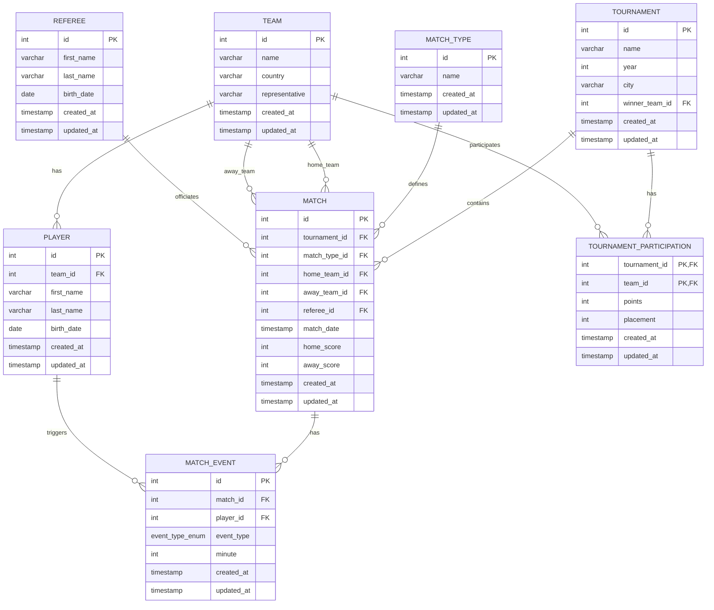

```mermaid
erDiagram
    TOURNAMENT {
        int id PK
        varchar name
        int year
        varchar city
        int winner_team_id FK
        timestamp created_at
        timestamp updated_at
    }

    TEAM {
        int id PK
        varchar name
        varchar country
        varchar representative
        timestamp created_at
        timestamp updated_at
    }

    PLAYER {
        int id PK
        int team_id FK
        varchar first_name
        varchar last_name
        date birth_date
        timestamp created_at
        timestamp updated_at
    }

    REFEREE {
        int id PK
        varchar first_name
        varchar last_name
        date birth_date
        timestamp created_at
        timestamp updated_at
    }

    MATCH_TYPE {
        int id PK
        varchar name
        timestamp created_at
        timestamp updated_at
    }

    MATCH {
        int id PK
        int tournament_id FK
        int match_type_id FK
        int home_team_id FK
        int away_team_id FK
        int referee_id FK
        timestamp match_date
        int home_score
        int away_score
        timestamp created_at
        timestamp updated_at
    }

    MATCH_EVENT {
        int id PK
        int match_id FK
        int player_id FK
        event_type_enum event_type
        int minute
        timestamp created_at
        timestamp updated_at
    }

    TOURNAMENT_PARTICIPATION {
        int tournament_id PK, FK
        int team_id PK, FK
        int points
        int placement
        timestamp created_at
        timestamp updated_at
    }

    TOURNAMENT ||--o{ TOURNAMENT_PARTICIPATION : has
    TEAM ||--o{ TOURNAMENT_PARTICIPATION : participates
    TEAM ||--o{ PLAYER : has
    TOURNAMENT ||--o{ MATCH : contains
    MATCH_TYPE ||--o{ MATCH : defines
    TEAM ||--o{ MATCH : home_team
    TEAM ||--o{ MATCH : away_team
    REFEREE ||--o{ MATCH : officiates
    MATCH ||--o{ MATCH_EVENT : has
    PLAYER ||--o{ MATCH_EVENT : triggers
```
